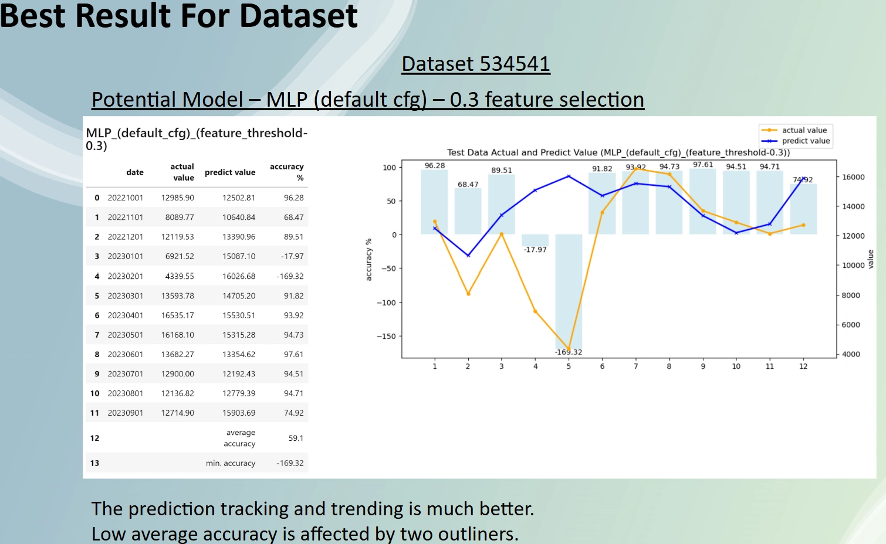
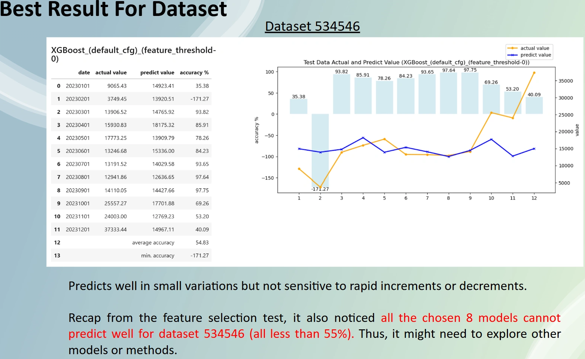

# Project Design Document

## Section 1 - Project Description

### 1.1 Project

Maritime Shipping Industry - Data Prediction

### 1.2 Description

- Real industrial datasets with artificial bias included are studied for prediction
- Three different datasets named 534541, 534546 and 549305 are investigated
- Each dataset prediction target column is the same name of the dataset
- Each dataset includes multiple columns features with number naming
- Data is recorded at the 1st day of every month from year 2000 to year 2023

### 1.3 Objective

- find the best model for each dataset on predicting the target column result under their features

### 1.4 Data Summary
|Dataset|Date Range|Total Samples|
|-|-|-|
|534541|Jan 2000 to Sep 2023|285|
|534546|Jan 2000 to Dec 2023|288|
|549305|Jan 2000 to Dec 2023|288|

### 1.5 Constraint

- ONE month lag between target to features is necessary
- Time series constraint is required to the dataset spliting for training and testing

 

## Section 2 - Phase Approach

### Phase 1 - Researching

- Data Wrangling and Normalization
- Apply choosen 0, 0.5 and 0.7 correlation factor between features to the target
- Testing models

    ||Model|
    |-|-|
    |1|Linear Regression|
    |2|Lasso Regression|
    |3|Ridge Regression|
    |4|Decision Tree Regression|
    |5|Random Forest|
    |6|Support Vector Regression|

- GridSearch is applied for the different hyperparameters to evaluate the dataset

### Phase 2 - Improvements

- Apply a full range of correlation factor to the three dataset on investigate
    - Features weighting to the prediction target
    - Features impact on models performance
- Expand more hyperparameters configuration
- Introduce two extra models
    - Extreme Gradient Boosting (XGBoost)
    - Multilayer Perceptron (MLP)

## Section 3 - Results

### [Detailed Project Report Here](https://docs.google.com/presentation/d/1vzLvmQ1f9gzsvuk5h-RmJjLIdovTewvH/edit?usp=sharing&ouid=107050956325506656132&rtpof=true&sd=true)

### Feature Selection

### Best For Dataset 549305

### Best For Dataset 534541

### Best For Dataset 534546

### END of Document

